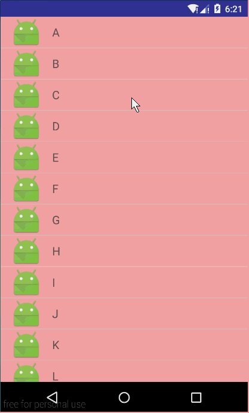

# listviewdemo2
高仿QQ！！！左滑删除ListView的Item

# 效果展示


# 使用方法

* 布局文件

主布局文件
```xml
<RelativeLayout
    xmlns:android="http://schemas.android.com/apk/res/android"
    xmlns:tools="http://schemas.android.com/tools"
    android:layout_width="match_parent"
    android:layout_height="match_parent"
    tools:showIn="@layout/activity_main"
    tools:context=".MainActivity">

    <cn.hzh.listviewdemo2.view.QQListView
        android:id="@+id/id_listview"
        android:layout_width="match_parent"
        android:layout_height="match_parent">
    </cn.hzh.listviewdemo2.view.QQListView>

</RelativeLayout>
```

每个item的布局文件，这个是自定义LinearLayout。
有两个子view，第一个显示内容的view，第二个显示右侧的view。
```xml
<cn.hzh.listviewdemo2.view.ItemView
    xmlns:android="http://schemas.android.com/apk/res/android"
    android:layout_width="match_parent"
    android:layout_height="48dp"
    android:orientation="horizontal"
    android:background="#44ff0000">

    <LinearLayout
        android:id="@+id/id_content_to_delete"
        android:layout_width="match_parent"
        android:layout_height="match_parent"
        android:orientation="horizontal">

        <ImageView
            android:layout_width="wrap_content"
            android:layout_height="wrap_content"
            android:layout_marginLeft="16dp"
            android:layout_gravity="center_vertical"
            android:src="@mipmap/ic_launcher"/>

        <TextView
            android:id="@+id/id_text"
            android:layout_width="match_parent"
            android:layout_height="match_parent"
            android:layout_marginLeft="16dp"
            android:gravity="center_vertical"
            android:text="hello world"
            android:textSize="18sp"/>
    </LinearLayout>

    <LinearLayout
        android:id="@+id/id_delete"
        android:layout_width="match_parent"
        android:layout_height="match_parent">

        <TextView
            android:layout_width="match_parent"
            android:layout_height="match_parent"
            android:background="#ff0000"
            android:gravity="center"
            android:text="删除"
            android:textColor="#fff"
            android:textSize="22sp"/>
    </LinearLayout>

</cn.hzh.listviewdemo2.view.ItemView>
```

* Activity中代码
```java
@Override
protected void onCreate(Bundle savedInstanceState)
{
	super.onCreate(savedInstanceState);
	setContentView(R.layout.activity_main);

	initDatas();

	mQQListView = (QQListView) findViewById(R.id.id_listview);
	mAdapter = new ArrayAdapter<String>(this,
		-1, mDatas)
	{
	    @Override
	    public View getView(int position, View convertView, ViewGroup parent)
	    {
		if(convertView == null)
		{
		    convertView = LayoutInflater.from(getContext()).inflate(R.layout.item, parent, false);
		}
		TextView tv = (TextView) convertView.findViewById(R.id.id_text);
		tv.setText(getItem(position));
		return convertView;
	    }
	};
	mQQListView.setAdapter(mAdapter);

	//点击右侧view的回调
	mQQListView.setOnItemRightViewClickListener(new QQListView.OnItemRightViewClickListener()
	{
	    @Override
	    public void onItemRightViewClick(int position, View view)
	    {
		//删除当前条目
		Log.d("TAG", "remove item");
		mDatas.remove(position);
		mAdapter.notifyDataSetChanged();
	    }
	});
}

private void initDatas()
{
	int i = 'A';
	for(; i <= 'Z'; i++)
	{
	    mDatas.add((char)i + "");
	}
}
```

# 原理简要分析
* 继承ListView，复写dispatchTouchEvent()方法和onTouchEvent()方法，监听用户左滑操作
* 对于item的view，也使用了自定义view(LinearLayout)。主要在屏幕右边放置一个RightView响应用户左滑操作，代码如下：
```java
public class ItemView extends LinearLayout
{
    private ViewGroup mContentView;
    private ViewGroup mRightView;

    //dp
    private static final int RIGHT_VIEW_WIDTH = 100;
    private int mRightViewWidth;

    public ItemView(Context context, AttributeSet attrs)
    {
        super(context, attrs);

        float density = getResources().getDisplayMetrics().density;
        mRightViewWidth = (int) (RIGHT_VIEW_WIDTH * density);
    }

    @Override
    protected void onLayout(boolean changed, int l, int t, int r, int b)
    {
        mContentView = (ViewGroup) getChildAt(0);
        mRightView = (ViewGroup) getChildAt(1);
        //设置contentview宽度
        int width = getMeasuredWidth();
        mContentView.getLayoutParams().width = width;
        //设置右侧view的宽度
        MarginLayoutParams lp = (MarginLayoutParams) mRightView.getLayoutParams();
        switch (lp.width)
        {
            case ViewGroup.LayoutParams.MATCH_PARENT:
            case ViewGroup.LayoutParams.WRAP_CONTENT:
                int count = mRightView.getChildCount();
                if(count > 1)
                    mRightViewWidth = mRightViewWidth * count;
                lp.width = mRightViewWidth;
                break;
        }

        super.onLayout(changed, l, t, r, b);
    }
}
```
上面代码主要就设置了ContentView和RightView的宽度

* 对外提供回调接口，用来响应用户对RightView的点击操作(比如从ListView中删除点击的Item)